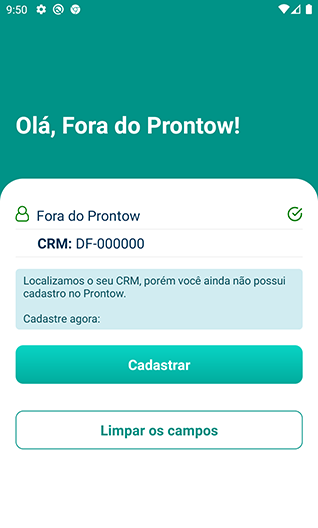

# App Auth
## ReactNative + (geolocation, image/camera picker, validate.js and input format)

Simple application with screens for authentication, registration, password recovery and reporting of misuse. Uses data from CRM (regional council of medicine) as the authentication name.
The objective was to apply techniques and save a model for reuse and save time on new projects.

## Screens
I used a global style resource and the following screens were developed:

### Dependencies

This project uses the following dependencies (use `yarn add`):
- axios
- react-native-animatable
- react-native-image-picker
- react-native-simple-toast
- react-native-text-input-mask
- validate.js

### Instructions
`Input Mask Testflight upload error`

- Reference react-native-text-input-mask: 
[Reference to use](https://blog.cloudboost.io/text-input-mask-for-react-native-3c04e82843a6)
- You might encounter the following error when trying to upload a build to Testflight: [Issue Input Mask](https://github.com/react-native-community/react-native-text-input-mask/issues/22)

- Inside `/node_modules/react-native-text-input-mask/index.js`, exchange componentWillReceiveProps to componentDidUpdate
